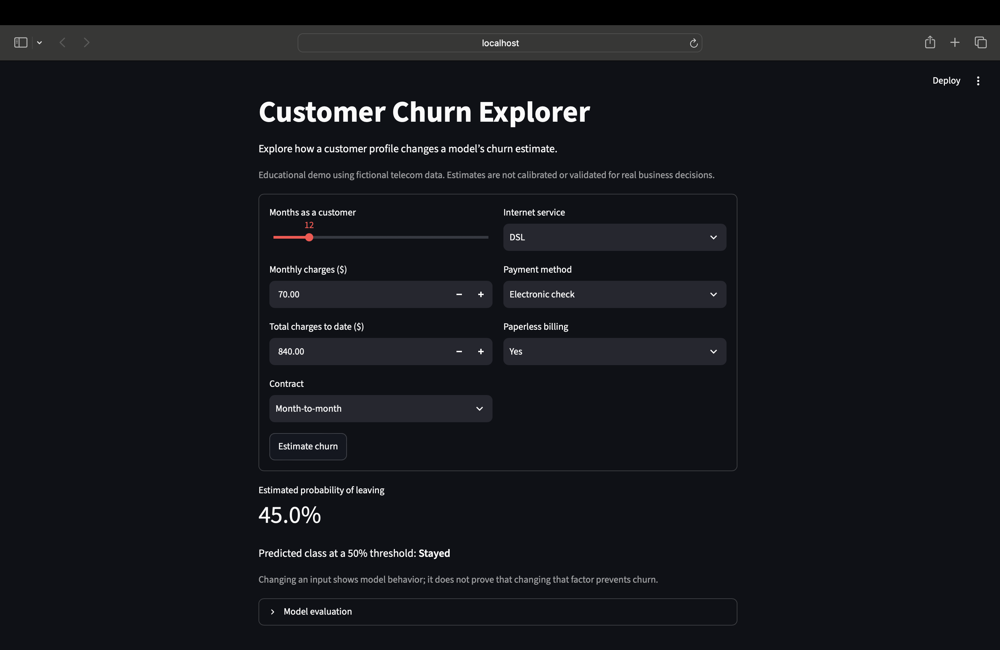
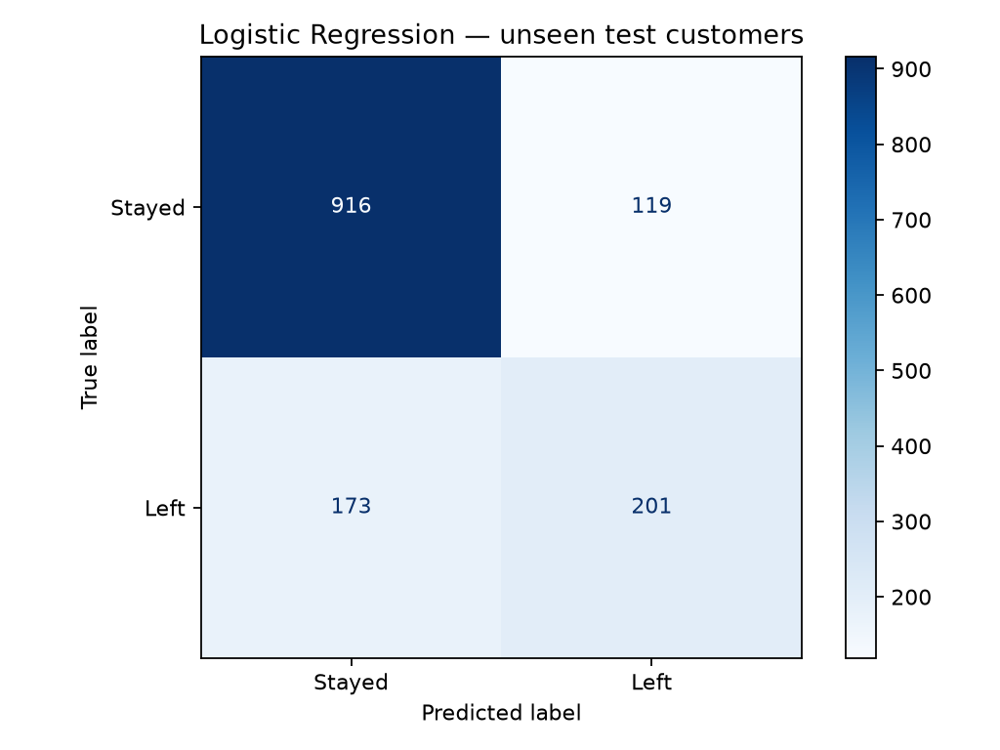
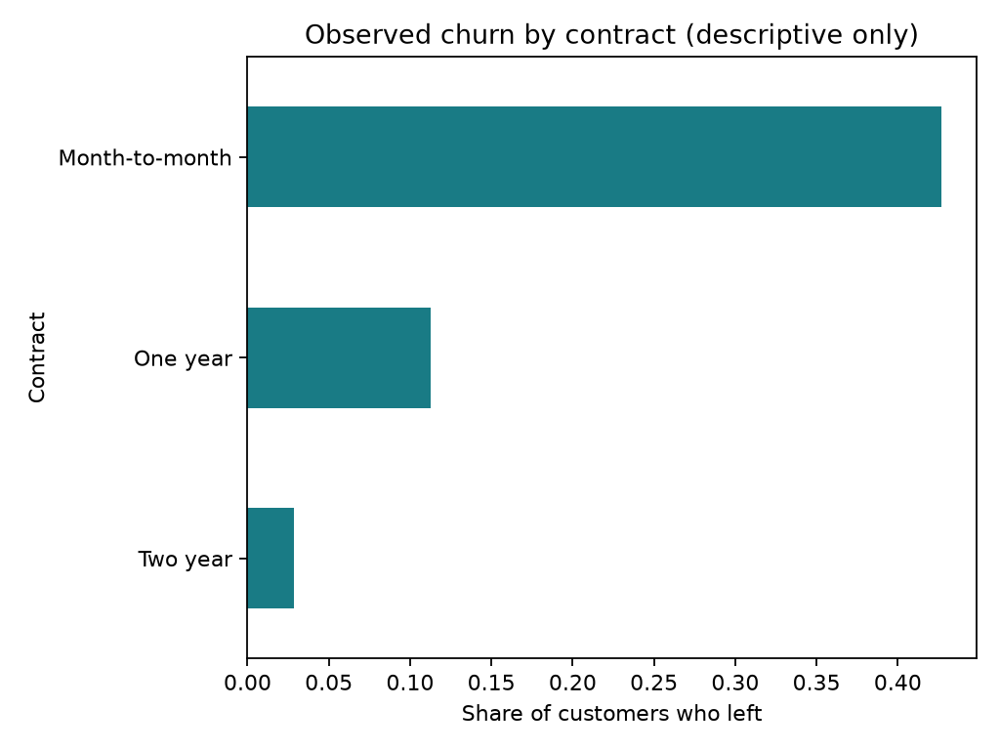

# Customer Churn Explorer

A Python machine learning portfolio project maintained by Bipul Dutta.
## App preview



## Business question
Which customer profiles are associated with leaving a telecom company? This project explores historical churn and compares two classifiers to estimate whether a customer leaves. It does not measure whether a retention campaign works.

## What is included
- Data cleaning and seven understandable customer features
- Logistic Regression, Random Forest, and a majority-class baseline
- Five-fold stratified cross-validation for model selection
- A separate 20% test set, confusion matrix, and performance reports
- A Streamlit app for exploring individual customer profiles

## Run locally (Python 3.11 recommended)
Open the extracted folder in VS Code, then open Terminal → New Terminal.

```bash
python -m venv .venv
```

Windows PowerShell:
```powershell
.\.venv\Scripts\Activate.ps1
```
If activation is blocked, use Command Prompt with `.venv\Scripts\activate.bat`, or run commands using `.venv\Scripts\python.exe` directly.

macOS:
```bash
source .venv/bin/activate
```

Then:
```bash
python -m pip install -r requirements.txt
python download_data.py
python train.py
python -m streamlit run app.py
```
On macOS, use `python3` for the initial environment command if necessary. Downloading data and installing packages require internet access. Train your own model before starting the app; model binaries are not distributed. Only load model files you created or trust.

## Measured results
Dataset: 7,043 rows; 5,634 training and 1,409 test rows. Seed: 42. Positive class: left (Churn = Yes). Classification threshold: 0.50.

| Model | Training CV F1 | Test accuracy | Churn precision | Churn recall | Churn F1 | ROC AUC |
|---|---:|---:|---:|---:|---:|---:|
| Logistic Regression | 0.582 | 79.3% | 0.628 | 0.537 | 0.579 | 0.835 |
| Random Forest | 0.559 | 78.6% | 0.615 | 0.516 | 0.561 | 0.837 |
| Majority baseline | — | 73.5% | 0.000 | 0.000 | 0.000 | 0.500 |

Logistic Regression was selected using training CV F1, before test evaluation. Random Forest has slightly higher test ROC AUC, but the test set is not used to change the selection. The selected model finds roughly 54% of customers who left at the fixed threshold. Accuracy alone conceals this limitation.




## How it works
`train.py` splits the data first. Numeric missing values are imputed and scaled inside each training pipeline. Categorical values are one-hot encoded. This keeps learned preprocessing out of validation and test data. Customer IDs and the churn label are excluded from inputs. The features are tenure, monthly charges, total charges, contract, internet service, payment method, and paperless billing.

## Data and attribution
Source: [IBM Telco Customer Churn repository](https://github.com/IBM/telco-customer-churn-on-icp4d), `data/Telco-Customer-Churn.csv`.
This is a fictional telecom sample for learning, not private customer records. Dataset ownership remains with its original provider; consult upstream terms before redistributing. This archive includes a download script instead of redistributing the dataset.

Technical reference: [scikit-learn pipelines](https://scikit-learn.org/stable/modules/compose.html).

## Limitations and next steps
- Historical associations are not causes; contract type alone does not prove why someone leaves.
- No time-based or external-company validation. No forecast horizon is independently established.
- Probabilities are uncalibrated. Unusual combinations in the app can be outside the training distribution.
- Only seven features are used to keep the first version understandable.
- Future work: calibration, threshold selection using validation data and business costs, more features, and external validation. Keep test data untouched during these decisions.
- No revenue savings or deployed business impact is claimed.

## Files
- `download_data.py`: retrieve source data
- `train.py`: cleaning, model comparison, evaluation, and saved model
- `app.py`: interactive prediction interface
- `reports/`: measured metrics and charts
- `requirements.txt`: supported dependency ranges
- `environment-tested.txt`: versions used for this initial training run

## Portfolio description
Customer Churn Explorer — A Python project comparing Logistic Regression and Random Forest on telecom sample data, with a Streamlit prediction interface. Includes leakage-aware preprocessing, cross-validation, a baseline comparison, and held-out evaluation.

## Publishing checklist
1. Run the app locally and explore at least three profiles.
2. Read the training script and understand precision, recall, F1, and the baseline.
3. Capture an app screenshot and add it to this README.
4. Create a GitHub repository named `customer-churn-prediction`; upload the project contents. The `.gitignore` excludes local environments, data, and model binaries.
5. Add the repository link and a screenshot to your portfolio. A live app requires separate hosting; GitHub Pages cannot run Python Streamlit apps.

Prepared with AI assistance. Review, run, and customize the project before presenting it as your work. Do not claim real-world deployment or independent implementation you have not completed.
